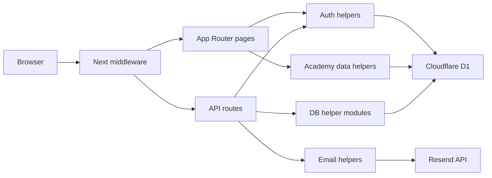
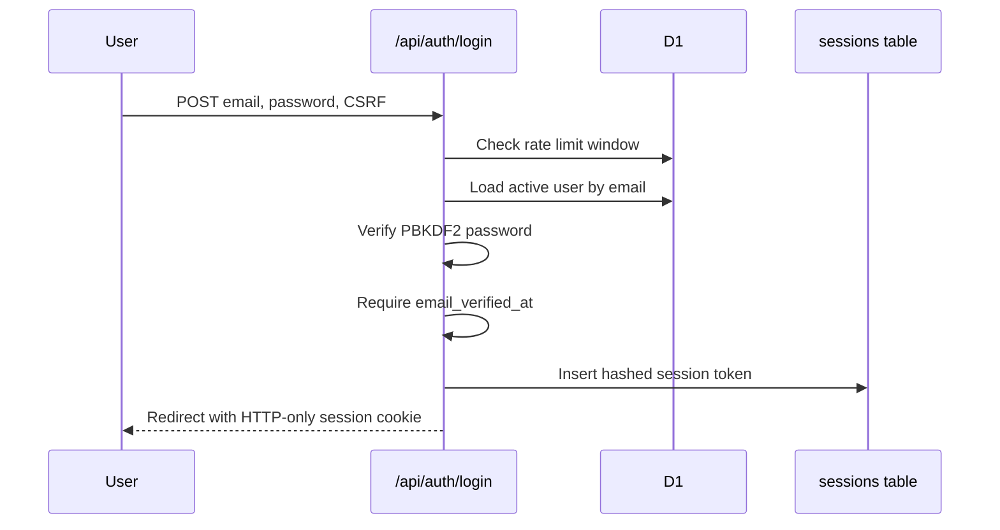
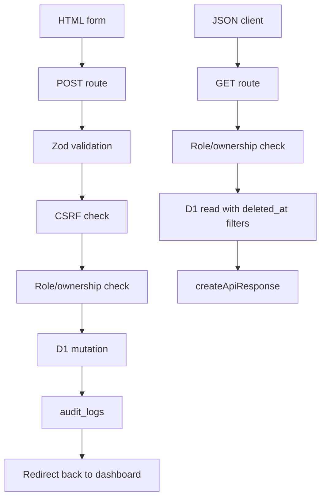

# Architecture

Al-Hayat Quran Learning Portal is a Next.js App Router application deployed to Cloudflare Workers through OpenNext. It uses Cloudflare D1 as the system of record and server-rendered dashboards for admin, teacher, student, and parent workflows.

## System Overview

## Runtime Layers

- `src/app`: public pages, dashboard pages, and route handlers.
- `src/components`: reusable UI pieces such as CSRF fields and dashboard widgets.
- `src/lib/auth.ts`: password hashing, session creation, session cookies, and role checks.
- `src/lib/db.ts`: Cloudflare environment and D1 binding access.
- `src/lib/db/*`: focused database helpers for common entity operations.
- `src/lib/utils/*`: error handling, validation schemas, CSRF, authorization, audit logging, rate limiting, logging, and email verification helpers.
- `src/lib/types/*`: shared API response types.

## Authentication Flow

Sessions are stored as SHA-256 token hashes in D1. Cookies are HTTP-only, same-site lax, secure, and expire after seven days.

## Security Controls

- Input validation uses Zod schemas in `src/lib/utils/schemas.ts`.
- API route failures are normalized through `handleError`.
- HTML form mutations use CSRF tokens.
- Role gates use `requireRole`.
- Ownership checks live in `src/lib/utils/authorization.ts`.
- Sensitive writes emit audit log records.
- Soft deletes use `deleted_at`; reads should filter deleted records.
- Login attempts are rate limited through the D1-backed `login_rate_limits` table.
- Email verification is required before login for newly registered real email accounts.
- Middleware applies baseline security headers.

## Error Handling Strategy

Route handlers should wrap work in `try/catch` and call `handleError(error)` for JSON errors. Existing browser form routes preserve redirect behavior for validation failures so current HTML workflows keep working.

JSON success responses should use `createApiResponse(data, message?, statusCode?)`.

## Data Flow

Dashboard pages call `getDashboardData` and related academy helpers server-side. API routes use `getDb` or focused DB helpers to perform validated writes and ownership-scoped JSON reads.

## Deployment

The Cloudflare deploy workflow runs linting, applies migrations, and deploys the Worker. Test workflow runs lint plus Jest coverage on push and pull request.
