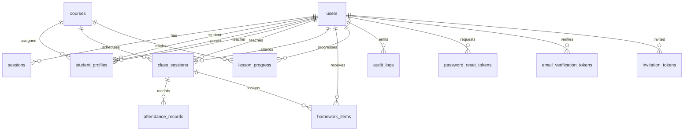

# Database

The portal uses Cloudflare D1. The current canonical schema is `db/schema.sql`, with incremental migrations in `db/migrations`.

## Entity Relationship Overview

## Core Tables

### `users`

Stores all account types: admin, teacher, student, and parent.

Important fields: `role`, `status`, `locale`, `password_hash`, `email_verified_at`, `deleted_at`, `updated_at`, `created_at`.

Key indexes: `email`, `role`, `status`, `deleted_at`, `(role, deleted_at)`.

### `courses`

Stores course metadata and availability.

Important fields: `title`, `description`, `level`, `status`, `deleted_at`.

Key indexes: `status`, `deleted_at`.

### `student_profiles`

Connects students to parents, teachers, and courses.

Important fields: `user_id`, `parent_id`, `teacher_id`, `course_id`, `learning_goal`, `deleted_at`.

Key indexes: `user_id`, `teacher_id`, `parent_id`, `course_id`, `deleted_at`.

### `class_sessions`

Stores scheduled learning sessions.

Important fields: `course_id`, `teacher_id`, `student_id`, `starts_at`, `meeting_provider`, `meeting_url`, `status`, `deleted_at`.

Key indexes: `course_id`, `teacher_id`, `student_id`, `status`, `starts_at`, `deleted_at`.

### `attendance_records`

Stores attendance for class sessions.

Important fields: `class_session_id`, `student_id`, `status`, `notes`, `marked_by`, `deleted_at`.

Key indexes: `student_id`, `class_session_id`, `marked_by`, `deleted_at`.

### `homework_items`

Stores assigned homework and teacher feedback.

Important fields: `class_session_id`, `teacher_id`, `student_id`, `title`, `instructions`, `due_at`, `status`, `feedback`, `deleted_at`.

Key indexes: `student_id`, `teacher_id`, `class_session_id`, `status`, `due_at`, `deleted_at`.

### `lesson_progress`

Stores course progress updates.

Important fields: `student_id`, `course_id`, `teacher_id`, `milestone`, `completion_percent`, `notes`, `deleted_at`.

Key indexes: `student_id`, `teacher_id`, `course_id`, `deleted_at`.

## Operational Tables

### `sessions`

Created by migration `0002_auth_seed.sql`. Stores hashed session tokens and expiry times.

Key indexes: `token_hash`, `user_id`, `expires_at`.

### `invitation_tokens`

Created by migration `0003_invitation_tokens.sql`. Stores one-time password setup invites.

### `audit_logs`

Stores sensitive operations such as create, update, delete, login, and logout events.

Key indexes: `user_id`, `(resource_type, resource_id)`, `action`.

### `password_reset_tokens`

Stores one-time password reset tokens. Tokens are hashed and expire after 24 hours.

Key indexes: `user_id`, `expires_at`.

### `email_verification_tokens`

Stores one-time email verification tokens. Tokens are hashed and expire after seven days.

Key indexes: `user_id`, `token_hash`, `expires_at`.

### `login_rate_limits`

Stores D1-backed login attempt counters by normalized email.

Key index: `window_expires_at`.

## Soft Delete Convention

Data tables use `deleted_at`. Reads should include `deleted_at IS NULL` unless explicitly reporting deleted data. Delete operations should prefer setting `deleted_at` and `updated_at` instead of removing records.

## Migration Order

1. `db/schema.sql` for a fresh database.
2. `0002_auth_seed.sql`
3. `0003_invitation_tokens.sql`
4. `0004_soft_deletes_audit.sql`
5. `0005_indexes.sql`
6. `0006_password_reset_tokens.sql`
7. `0007_email_verification_rate_limits.sql`

Some migrations are additive and are guarded in deployment workflow checks because older databases may already contain portions of the schema.
